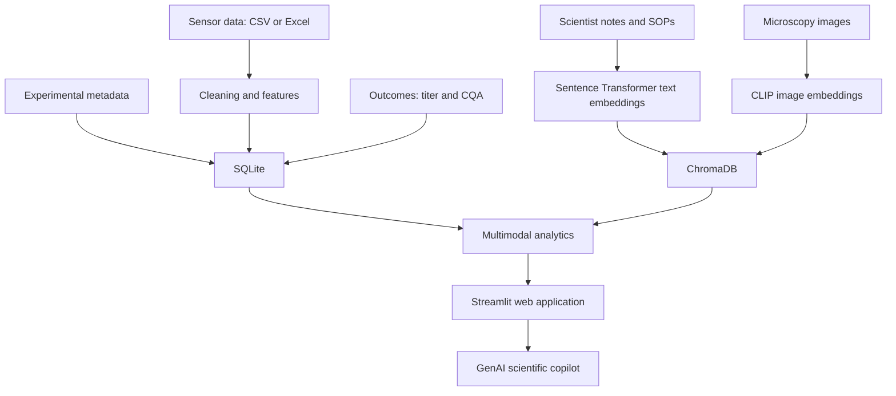
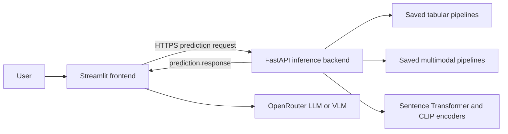

# Bioprocess Multimodal Intelligence Platform: learning plan

This document follows the user's project concept, technology choices, and twelve milestones. Build the project step by step, explaining each stage before implementation. Keep application setup and function descriptions in `README.md`; keep the learning roadmap here.

## Project concept

Analyze bioreactor runs by combining process sensor data, experimental metadata, scientist notes, and microscopy images to understand culture behavior, identify anomalous runs, retrieve similar historical experiments, and explain factors associated with final process outcomes such as titer or viability.



| Component | Selected technology |
| --- | --- |
| Relational database | SQLite |
| Vector database | ChromaDB |
| Web application | Streamlit |
| Machine learning | scikit-learn, with XGBoost for the planned comparison |
| Text embeddings | Sentence Transformers |
| Image embeddings | CLIP |
| Visualization | Plotly |

Develop locally on Windows without requiring Docker. Retain free OpenRouter LLM/VLM usage and Streamlit Community Cloud as deployment targets. Sentence Transformers, CLIP, and ChromaDB are core parts of this plan.

The deployed application uses two services:



Streamlit Community Cloud hosts the frontend. FastAPI runs as a separate Python/ASGI service because it is an independently addressable backend process. During development, run both services locally; select and document the backend host when deployment begins.

## Demo data

Simulate around 40-60 bioreactor runs, starting with 50. Each run combines structured measurements, metadata, text, and images, with final outcomes for analysis.

### Process measurements

Record these fields:

```text
batch_id, time_hr, temperature, pH, DO, agitation_rpm,
air_flow, O2_flow, CO2_flow, feed_rate, glucose, lactate,
viable_cell_density, viability
```

Include a simulated titer trajectory for the planned plots and a final-titer outcome. Document units consistently for all measurements. Ten days sampled every four hours, including both endpoints, gives 61 measurements per batch and 3,050 rows for 50 batches.

### Experimental metadata

```text
batch_id, cell_line, media_type, media_lot, bioreactor_scale,
seed_density, feed_strategy, experiment_date
```

### Text records

Examples:

- Scientist note: "DO became unstable after 72 h. Increased agitation from 300 to 340 rpm."
- Observation: "Cell growth slower than historical runs after day 4."
- Experiment description: "Run designed to evaluate increased feed starting at 48 h."

Add SOP excerpts and process descriptions later. Associate records with batch IDs, timestamps, and text types.

### Microscopy images

Associate images with selected batch time points, such as `B001_24h.png`, `B001_48h.png`, `B001_72h.png`, and `B031_96h.png`. Include differences in cell density, aggregation, debris, morphology, and culture appearance.

Clearly label synthetic or illustrative images. If using public microscopy data later, retain its source and license information. Keep simulated observations aligned with the corresponding process events.

## Database design

SQLite stores structured data and the metadata linking notes and images to each run. ChromaDB stores text and image embeddings with identifiers that connect back to SQLite.

| SQLite table | Fields |
| --- | --- |
| `batches` | `batch_id` PK; `cell_line`, `media_type`, `media_lot`, `bioreactor_scale`, `seed_density`, `feed_strategy`, `experiment_date` |
| `sensor_data` | `measurement_id` PK; `batch_id` FK; `time_hr`, `temperature`, `pH`, `DO`, `agitation_rpm`, `air_flow`, `O2_flow`, `CO2_flow`, `feed_rate`, `glucose`, `lactate`, `viable_cell_density`, `viability`, `titer` |
| `outcomes` | `batch_id` PK/FK; `final_titer`, `final_viability`, `max_VCD`, `quality_metric` |
| `text_records` | `text_id` PK; `batch_id` FK; `time_hr`, `text_type`, `content` |
| `images` | `image_id` PK; `batch_id` FK; `time_hr`, `file_path`, `image_type` |

Use `agitation_rpm` and `viable_cell_density` consistently in stored sensor data; display labels may use agitation and VCD. The schema includes the gas-flow channels and media lot from the proposed data specification. Define the simulated quality metric and its units during data generation.

| ChromaDB collection | Contents |
| --- | --- |
| `bioprocess_notes` | Text embeddings; record ID corresponding to `text_id`; metadata: `batch_id`, `time_hr`, `text_type` |
| `microscopy_images` | Image embeddings; record ID corresponding to `image_id`; metadata: `batch_id`, `time_hr`, `image_type` |

SQLite answers: "Give me pH and DO for B023." ChromaDB answers: "Find notes semantically similar to DO instability" or "Find historical images similar to this image."

## Milestone 1 - Project skeleton and Git

**Goal:** learn the project structure before doing ML.

**Status:** Complete and locally verified on October 3, 2026.

```text
bioprocess-multimodal-intelligence/
|-- app.py
|-- data/
|   |-- raw/
|   `-- processed/
|-- database/
|-- images/
|-- notebooks/
|-- src/
|   |-- data/
|   |-- models/
|   |-- embeddings/
|   `-- visualization/
|-- pages/
|-- docs/
|   `-- LEARNING_PLAN.md
|-- requirements.txt
|-- README.md
`-- .gitignore
```

Explain what each folder contains before creating files. Create a minimal Streamlit application displaying:

```text
Bioprocess Multimodal Intelligence Platform

Status:
✓ Streamlit working
✓ Python environment working
```

**Learn:** Python virtual environments, Git, GitHub, imports, and basic project organization.

**Completion:** run the welcome page locally, understand the files, document setup in README, and commit the milestone.

**Example task:** "Explain what each folder should contain before creating files. Then create the minimum Streamlit application without analytics."

## Milestone 2 - Generate synthetic bioprocess data

**Goal:** create data you understand before introducing databases.

**Status:** Complete and locally verified on October 3, 2026.

Generate 50 batches over 10 days, with measurements every four hours. Simulate growth and decline in VCD, feed-related glucose changes, lactate accumulation and consumption, and increasing titer. Introduce controlled variation in seed density, media type, feed rate, DO stability, and pH variability.

| Batch | Intended abnormal behavior |
| --- | --- |
| B007 | High lactate |
| B014 | DO instability |
| B023 | Low cell growth |
| B031 | Excessive aggregation |
| B044 | Low titer |

Record the planted scenarios as evaluation truth. Use a reproducible random seed and keep those labels outside model inputs. Generate corresponding metadata, notes, images, and outcomes so later milestones can connect the modalities. Label the simulator's biological assumptions and illustrative images clearly.

Start in `notebooks/01_generate_data.ipynb`. Move stable generation code into `src/data/generate_data.py`.

**Learn:** NumPy, pandas, random sampling, time-series generation, DataFrames, and CSV.

**Completion:** inspect the trajectories and abnormal runs, verify reproducibility and batch/time consistency, and export the dataset.

## Milestone 3 - Build the relational database

Create `database/bioprocess.db` and load `batches`, `sensor_data`, `outcomes`, `text_records`, and `images`. Define primary and foreign keys and enable foreign-key checks when loading data.

Practice:

```sql
SELECT * FROM batches;

SELECT b.batch_id, b.media_type, o.final_titer
FROM batches AS b
JOIN outcomes AS o ON b.batch_id = o.batch_id;
```

Then query from Python:

```python
import sqlite3
import pandas as pd

conn = sqlite3.connect("database/bioprocess.db")
try:
    df = pd.read_sql_query("SELECT * FROM sensor_data", conn)
finally:
    conn.close()
```

**Learn:** tables, schemas, primary keys, foreign keys, JOIN, WHERE, GROUP BY, and SQL from Python.

**Completion:** retrieve a batch's measurements and join metadata to outcomes. Verify that loading data again does not create duplicates.

## Milestone 4 - Build the process-data dashboard

Build Overview, Batch Explorer, Batch Comparison, and Data Quality before adding GenAI.

Batch Explorer should allow selection of a batch, such as B014, and variables including pH, DO, VCD, lactate, and titer. Plot trajectories with Plotly and compare the selected batch with historical normal/reference batches. Include means, standard deviations, minimum/maximum values, missing values, and outliers.

**Learn:** Streamlit widgets, Plotly, groupby, filtering, SQL queries, and data visualization.

**Completion:** investigate the planted anomalies through charts and summary statistics. At this point the application is a usable analytics portfolio demo.

## Milestone 5 - Feature engineering and predictive modeling

Convert full trajectories into batch-level features:

```text
peak_VCD, time_to_peak_VCD, max_lactate, min_glucose,
mean_DO, DO_std, pH_std, total_feed, growth_rate
```

Predict `final_titer` and compare **Linear Regression, PLS, Random Forest, and XGBoost**. Calculate total feed by integrating feed rate over time with consistent units.

Use batch-level train/test splitting: timestamps from one batch must never appear in both training and test sets. Fit preprocessing and model selection within training data. Exclude the target and direct target-derived features, including final titer measurements, from predictors.

Full-run features support an end-of-run analysis. If early forecasting is added later, restrict inputs to information available at the forecast time and label the task accordingly.

**Learn:** feature engineering, train/test splitting, cross-validation, R-squared, RMSE, residuals, feature importance, and overfitting.

**Completion:** add a Predictive Modeling page with the model comparison and held-out results. Explain the limitations of evaluating models on 50 synthetic batches.

Save each fitted tabular preprocessing-and-model pipeline as a versioned, trusted artifact for later FastAPI inference. Store its expected input schema, feature cutoff, target units, training-data version, library versions, and evaluation metrics beside the artifact. Do not save only the estimator if preprocessing is required to reproduce a prediction.

## Milestone 6 - Add text embeddings

Use a small **Sentence Transformer** to encode scientist notes. Select a model with 384-dimensional embeddings for the proposed example and record its model identifier.

```text
Text → tokenization → Sentence Transformer → embedding vector
```

Store embeddings in the ChromaDB collection `bioprocess_notes`, with `text_id`, `batch_id`, `time_hr`, and `text_type`. Encode search queries with the same model used for the stored notes.

Implement semantic search for queries such as "oxygen control problem." Retrieve notes such as "DO oscillations started around 72 h" and "Agitation increased because dissolved oxygen fell," with links to their source batches.

**Learn:** embeddings, semantic similarity, cosine similarity, vector databases, and metadata filtering.

**Completion:** search notes by meaning and inspect ranked results, source records, and metadata filters.

## Milestone 7 - Add image embeddings

Use **CLIP** to encode microscopy images and store the vectors in a second ChromaDB collection, `microscopy_images`.

```text
Microscopy image → CLIP preprocessing and image encoder → embedding vector
```

Implement image similarity search. For example, select B031's 96 h image and retrieve similar historical images with batch IDs, time points, and scores. Exclude the query image itself. Join the retrieved batches to relevant outcomes and observations, such as aggregation, reduced viability, or debris.

Record the CLIP model and preprocessing configuration, and use the same configuration for new queries. Embedding dimensions depend on the selected model; 512 dimensions is the proposed example. Interpret retrieval scores according to the collection's distance metric.

**Learn:** image preprocessing, CLIP, image embeddings, nearest-neighbor retrieval, and vector databases.

**Completion:** retrieve visually similar images and inspect their associated process histories. Treat similarity as exploratory evidence and assess whether the model captures the intended image differences.

## Milestone 8 - Event/time alignment across modalities

Investigate an event such as **B014, 72-96 h**. Retrieve sensor measurements, scientist notes, and microscopy images for that window, together with the final outcome for retrospective context.

```text
Event
batch_id = B014
start = 72
end = 96

sensor_features
text_embeddings
image_embeddings
outcome
```

Define how images are selected when capture times do not exactly match the window. Preserve timestamps and show missing evidence explicitly.

**Learn:** temporal alignment, event windows, joining heterogeneous data, and feature aggregation.

**Completion:** show the linked sensor, text, image, and outcome evidence for a selected event before adding an LLM.

## Milestone 9 - Multimodal analytics

Start with interpretable late fusion:

- Structured model: sensor features → titer prediction and sensor anomaly evidence.
- Text analysis: note embeddings → similar-event score.
- Image analysis: image embeddings → morphology anomaly score.

Explore the proposed combined score:

```text
Multimodal risk score =
    0.5 × sensor anomaly
  + 0.2 × text anomaly
  + 0.3 × image anomaly
```

Normalize component scales, define how similarity becomes anomaly evidence, explain the weights, and handle missing modalities explicitly. The initial weighted score is a heuristic, not a calibrated failure probability.

This milestone develops the evidence-level fusion and the meaning of each component score. Training predictive models on concatenated multimodal features is the separate next milestone.

**Learn:** multimodal fusion, normalization, score interpretation, missing modalities, and dependence between modalities.

**Completion:** inspect how each modality contributes to the heuristic investigation score and explain its limits. This score is distinct from the trained multimodal models in Milestone 10.

## Milestone 10 - Train and compare multimodal fusion models

Create one modeling row per batch by joining the structured batch features from Milestone 5 with pooled text and image embeddings from Milestones 6 and 7.

### Build the fused feature table

For each batch:

1. Use approximately 30 engineered sensor and metadata features.
2. Pool all eligible 384-dimensional note embeddings into one fixed-length batch vector. Start with mean pooling and retain the number of notes as a separate feature.
3. Pool all eligible 512-dimensional image embeddings into one fixed-length batch vector. Start with mean pooling and retain the number of images as a separate feature.
4. Preserve `batch_id` only as the join key; never use it as a predictor.
5. Add explicit modality-availability indicators and a documented strategy for missing notes or images.

The proposed dimensionality experiment is:

```text
384-dimensional text embedding → PCA → up to 20 text features
512-dimensional image embedding → PCA → up to 20 image features

approximately 30 tabular features
+ up to 20 reduced text features
+ up to 20 reduced image features
= up to 70 fused features
```

Treat 20 components per embedding type as a value to test, not a fixed requirement. For every training fold, cap each PCA dimension at a valid value below both the number of training samples and the original embedding dimension. Select the number of components using training data only.

### Compare feature sets fairly

Train the same four model families introduced in Milestone 5:

- Linear Regression
- PLS
- Random Forest
- XGBoost

Use the same held-out batch IDs and the same cross-validation folds for every comparison. Keep the model settings and tuning budget comparable. Evaluate these feature sets:

| Feature set | Purpose |
| --- | --- |
| Tabular only | Baseline from Milestone 5 |
| Tabular + text | Measure the incremental value of notes |
| Tabular + image | Measure the incremental value of microscopy |
| Tabular + text + image | Evaluate complete feature-level fusion |

Build each model as a training pipeline. Fit missing-value handling, scaling, the text PCA branch, the image PCA branch, and model hyperparameters using training folds only. The held-out test batches must not influence PCA components, preprocessing, model selection, or the low-titer threshold.

### Targets and metrics

Use `final_titer` as the primary continuous target so the fused models can be compared directly with the same tabular-only regressors from Milestone 5. Report RMSE, MAE, R-squared, and residual plots on the unchanged held-out test set.

Also evaluate low-titer event detection as a secondary view. Define the low-titer threshold from domain rules or the training set only, apply that fixed threshold to actual and predicted titer in the test set, and report precision, recall, F1, and a confusion matrix. This preserves the same regression model set while showing whether predictions identify low-titer runs. If direct classification is explored later, compare corresponding classifier families in a clearly separate experiment.

### Data-volume and leakage checks

Fifty batches are likely too few for a stable model with up to 70 fused features. Keep the 50-batch dataset for the earlier learning milestones, then generate a larger reproducible modeling dataset, initially 200-300 batches, for this experiment. Use the same simulator rules and reserve the original named abnormal batches as understandable examples.

Exclude text written after the prediction cutoff, notes that state the final outcome, and images captured after the cutoff whenever the task is prospective prediction. For the original full-run retrospective model, label the result as end-of-run prediction and apply the same eligibility window to all compared feature sets. Do not use planted scenario labels, filenames that encode outcomes, or generator parameters as predictors.

### Results page

Extend Predictive Modeling or add a **Multimodal Predictive Modeling** page containing:

- A table comparing every model and feature set on the same test batches.
- Predicted-versus-actual and residual plots for final titer.
- Low-titer confusion matrices and event metrics.
- Ablation results showing the change from adding text, images, or both.
- Training and inference time, feature counts after PCA, and the selected component counts.
- A clear conclusion about whether multimodal fusion improved generalization over tabular data alone.

**Learn:** feature-level fusion, embedding pooling, PCA within cross-validation, multimodal ablation studies, fair baseline comparison, low-titer event evaluation, sample-size limits, and leakage prevention.

**Completion:** produce a reproducible comparison in which all feature sets use identical splits and evaluation rules. Accept a negative result if fused features do not improve held-out performance; the purpose is to measure their added value rather than assume it.

Export the selected multimodal pipelines for inference together with the exact Sentence Transformer, CLIP, pooling, missing-modality, scaling, and PCA configuration. The deployed pipeline must reproduce the same transformation sequence used during evaluation.

## Milestone 11 - FastAPI model inference backend

Build a FastAPI service that loads the trusted artifacts produced in Milestones 5 and 10 and predicts final titer for a new run. Training remains an offline workflow; API requests perform validation, feature generation, embedding, preprocessing, and inference only.

Add the backend files when this milestone begins:

```text
backend/
|-- __init__.py
|-- main.py                 # FastAPI application and routes
|-- schemas.py              # Versioned Pydantic request/response models
|-- dependencies.py         # Model registry and application dependencies
`-- settings.py             # Environment-based configuration
artifacts/
|-- tabular/                # Trusted fitted pipelines and manifests
`-- multimodal/             # Fitted pipelines, PCA, and encoder manifests
src/
|-- features/               # Shared tabular and multimodal transformations
`-- inference/              # Artifact loading and prediction services
tests/
|-- fixtures/               # Representative new-run request data
`-- test_api.py
requirements-backend.txt
```

Keep training scripts outside the request path. `requirements-backend.txt` contains only packages needed to validate inputs, transform new runs, load the encoders and pipelines, and serve predictions.

### Prediction inputs

Support two related workflows:

| Workflow | User-provided data | Backend processing |
| --- | --- | --- |
| Tabular baseline | Experimental metadata plus a sensor time-series CSV | Validate fields and units, calculate the same batch features as Milestone 5, and run the saved tabular pipelines |
| Multimodal | The same metadata and sensor data, plus timestamped notes and microscopy images | Calculate tabular features, encode and pool text/images, apply the saved PCA branches, and run the saved multimodal pipelines |

Do not ask users to calculate PCA values or embeddings themselves. Accept raw notes and images so the backend owns the complete reproducible inference pipeline. The selected prediction cutoff must match the trained model. Reject post-cutoff records for a prospective model rather than silently using them.

Define versioned Pydantic schemas for metadata, timestamps, units, allowed categories, and response fields. For multimodal uploads, use a multipart request containing structured metadata, a sensor CSV, an optional notes file, and one or more image files. Limit file count and size and allow only documented CSV and image formats.

### Initial API contract

| Method and path | Purpose |
| --- | --- |
| `GET /health` | Confirm that the service and required model artifacts loaded successfully |
| `GET /v1/models` | Return available model IDs, versions, modalities, prediction cutoff, required inputs, and target units |
| `POST /v1/predict/tabular` | Return final-titer predictions from the four tabular model pipelines |
| `POST /v1/predict/multimodal` | Return predictions from the four fused model pipelines and report which modalities were present |

Return a prediction per requested model, the units, model/data version, feature cutoff, low-titer threshold and flag, warnings, and missing-modality information. Do not claim prediction intervals unless a valid interval method is implemented and evaluated.

Use explicit model IDs rather than accepting arbitrary filesystem paths or uploaded model objects. Load only artifacts created by the project's trusted training workflow. Keep feature extraction in shared `src/` modules used by both training and serving so formulas cannot drift.

### Streamlit integration

Add a **New Run Prediction** page with two modes:

1. **Tabular baseline:** upload metadata and sensor data, validate them visibly, select one or all trained models, and request predictions.
2. **Multimodal:** add notes and microscopy images, preview the parsed inputs, then request fused predictions.

Show baseline and multimodal predictions together when both are available. Display the difference as a model comparison, not as proof that one prediction is correct. Include model version, target units, cutoff, supplied modalities, and validation warnings in the result. Never display the backend application token in the UI or logs.

Configure the backend base URL and service token through environment variables locally and Streamlit secrets when hosted. The browser interacts with Streamlit; Streamlit makes the authenticated server-to-server API request. Configure request timeouts and return understandable messages for validation failures, unavailable models, backend startup delays, and inference errors.

### Verification and deployment

Test the API with known held-out batches serialized in the same format a user uploads. Confirm that API predictions match predictions made directly by the saved pipelines. Add tests for invalid columns, units, timestamps, oversized files, missing modalities, and incompatible model versions.

Run locally as two processes first:

```text
Streamlit frontend → http://localhost:<api-port> → FastAPI backend
```

Then deploy FastAPI to an HTTPS-accessible Python/ASGI host and place its URL and service token in Streamlit Community Cloud secrets. Benchmark startup time, memory, request duration, and concurrent requests with Sentence Transformers and CLIP loaded. If the chosen host cannot hold both encoders and model artifacts, measure that constraint before deciding whether to resize the service or split embedding inference into a later service.

**Learn:** REST APIs, FastAPI, Pydantic validation, multipart uploads, model serialization, reproducible inference pipelines, frontend/backend communication, secrets, API versioning, and deployment diagnostics.

**Completion:** a user can submit the same new run to both endpoints from Streamlit, receive reproducible predictions from the selected tabular and multimodal models, and see clear validation and model-version information. Direct pipeline and API predictions agree for test fixtures.

## Milestone 12 - GenAI scientific copilot

Add GenAI after the data, retrieval, alignment, and analytics are working:

```text
User question
    → Python determines the relevant batch/event
    → SQLite retrieves structured data
    → ChromaDB retrieves relevant notes and images
    → ML analytics generate numeric evidence
    → Evidence is sent to the LLM through OpenRouter
    → Scientific explanation
```

Example question: **"Why was titer low in B014?"**

An illustrative evidence bundle could contain a final titer of 3.1 g/L, a historical average of 4.6 ± 0.5 g/L, DO variability 42% higher than the reference, peak VCD 18% lower, lactate 31% higher, a note about DO oscillations after 72 h, and a 96 h image resembling historical high-debris runs. These numbers are examples; the app must calculate actual values from its dataset.

Ask the LLM to explain the measured differences, cite retrieved observations, and distinguish supported associations from hypotheses. Report model contributions only when supported by the chosen analysis. Avoid describing synthetic notes as independent confirmation when they were generated from the same simulated event.

Use a free OpenRouter LLM for explanations. A free VLM can optionally inspect retrieved images at this stage, while CLIP remains responsible for image embeddings and retrieval. Handle unavailable models or quota errors by preserving access to the underlying evidence.

**Learn:** evidence retrieval, context construction, LLM/VLM API calls, grounded explanations, and response evaluation.

**Completion:** answer selected scientific questions with traceable sensor, note, image, and model evidence.

## Final Streamlit navigation

```text
Bioprocess Multimodal Intelligence
|-- Overview
|-- Data Integration
|-- Data Quality
|-- Batch Explorer
|-- Batch Comparison
|-- Statistical Analysis
|-- Predictive Modeling
|-- Text Intelligence
|-- Microscopy Intelligence
|-- Multimodal Investigation
|-- Multimodal Predictive Modeling
|-- New Run Prediction
`-- Scientific Copilot
```

## Deployment notes

Keep the twelve milestones above as the learning sequence. Deployment preparation supports that architecture:

- Precompute corpus embeddings locally where useful; use the same Sentence Transformer or CLIP encoder for new queries. Cache model loading and benchmark memory use before cloud deployment.
- Make SQLite and ChromaDB demo data reproducible from versioned source files. Community Cloud does not guarantee persistence of local writes; treat runtime changes as temporary. See [Streamlit storage guidance](https://docs.streamlit.io/develop/concepts/connections/connecting-to-data).
- Verify the combined application's resource use with its actual embedding models and databases. Resolve measured deployment issues when they arise. See [Community Cloud resources](https://docs.streamlit.io/deploy/streamlit-community-cloud/manage-your-app).
- Host FastAPI separately from Streamlit Community Cloud, expose it only over HTTPS, and configure its URL and service credential through secrets. Pin the inference environment to versions compatible with the saved artifacts.
- Select currently available free OpenRouter models at the copilot milestone, check image support for VLM requests, and store credentials in Streamlit secrets. See [OpenRouter free routing](https://openrouter.ai/docs/guides/routing/routers/free-router) and [Streamlit secrets](https://docs.streamlit.io/deploy/streamlit-community-cloud/deploy-your-app/secrets-management).

Update README with tested installation, launch, data preparation, and deployment commands as those functions are implemented. This document is the learning plan; application implementation has not started.
